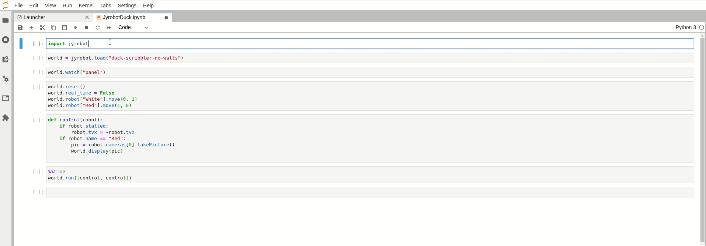

# aitk.robots

[](https://badge.fury.io/py/aitk.robots) [](https://app.circleci.com/pipelines/github/ArtificialIntelligenceToolkit/aitk.robots)

A lightweight Python robot simulator for Jupyter Lab, Notebooks,
and other environments.

## Goals

1. A lightweight mobile robotics simulator
2. Usable in the classroom, research, or exploration
3. Explore wheeled robots with range, cameras, and light sensors
4. Operate quickly without a huge amount of resources
5. Create reproducible experiments
6. Designed for exposition, experimentation, and analysis
7. Sensors designed for somewhat realistic problems (such as image recognition)
8. Especially designed to work easily with Machine Learning and Artificial Intelligence systems



## Examples

There are pre-designed simulations ready to run, like this:

```python
import aitk.robots
import random

world = aitk.robots.load("two-scribblers")

for robot in world.robots:
    # Give each robot a desired speed:
    robot.forward(1)

def control(world):
    for robot in world.robots:
        if robot.stalled:
	    # If stuck, just reverse:
            robot.reverse()
	# Turn randomly:
        robot.turn(1 - random.random() * 2)

# Watch the robots move in real time, or faster:
world.watch()
world.run(control, show=True, real_time=False)
# Press Control+C or interrupt the kernel to stop
```

You can also easily assemble your own simulations, robots, and sensors.

```python
import aitk.robots

world = aitk.robots.World(width=100, height=100)
world.watch()

robot = aitk.robots.Scribbler()

world.add_robot(robot)

robot.add_device(aitk.robots.RangeSensor())
robot.add_device(aitk.robots.Camera())

world.save_as("world-1")
```

## Installation

For the core operations, you will need to install just aitk.robots:

```shell
pip install aitk.robots
```

For just image processing on top of of the core, you will need:

* Pillow - Python Image Library (PIL)

For the full set of options, you will need:

* Pillow - Python Image Library (PIL)
* ipywidgets
* IPython

To use the Jupyter enhancements, you'll also need the browser-based
extensions. You can install those with:

```
jupyter labextension install @jupyter-widgets/jupyterlab-manager ipycanvas
```

If not in a conda environment, then you will also need to:

```
jupyter nbextension enable --py widgetsnbextension
```
